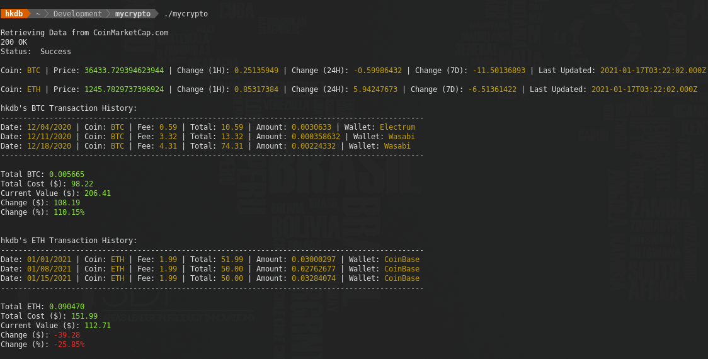

# MyCrypto - A Terminal-Based CryptoCurrency Portfolio Tracker
maintained by: hkdb@3df.io



## SUMMARY
This is a terminal-based CryptoCurrency `(BTC and ETH only for now)` Portfolio Tracker that was made to track crypto assets across multiple wallets and platforms locally (as opposed to a cloud service). It grabs the latest data from CoinMarketCap.com via API and then calculates those numbers against the users existing portfolio which is manually filled-in by the user in CSV format.

## CHANGELOG

- 01/16/2021 - first commit

## PLATFORMS
- Linux: Tested on Pop! OS 20.04 LTS
- Windows: Not tested but should work?
- Mac: Not tested but should work?

## DEPENDENCIES
- CoinMarketCap.com API account and API key
- Manually filling in all of your transactions into csv format

## INSTALLATION
1. Clone this repo:
   
   ```
   git clone https://github.com/hkdb/mycrypto.git
   ``` 
2. Enter into the repo directory, create a .config file based on .config.sample, and fill-in the NAME variable with your name without spaces and CMC_API variable with your own CoinMarketCap.com API key
   
   ```
   NAME = NameWithNoSpaces 
   CMC_API = CoinMarketCapApiKey
   ```
3. Execute the following in terminal:
   
   ```
   ./install.sh
   ```
   This install script does the following:

   ```
   Creates a symlink to binary in ~/.local/bin
   ```

4. Create <your name>-btc.csv and <your name>-eth.csv based on sample-btc.csv and sample-eth.csv respectively and fill-in all of your transactions
   
   ```
   Date,Coin,Cost,Fee,Total,Amount,Wallet
   12/04/2020,BTC,100.00 ,0.59,10.59,0.0030633,Electrum
   ```

## USAGE
Execute the following command from the terminal:

```
mycrypto
```

## BUILD
To build from source, execute the following from with in the repo directory:

```
go get
go build
```

## DISCLAIMER

This repo is sponsored by 3DF OSI and is maintained by volunteers. 3DF Limited, 3DF OSI, and its volunteers including the author in no way make any guarantees. Please use at your own risk!

To Learn more, please visit:

https://osi.3df.io

https://3df.io 
